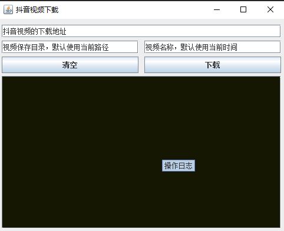

# tiktok-video-tool

抖音分享视频无水印下载工具；仅供学习使用；下载已经打包好的文件直接双击运行即可（注意需要安装jdk）

### 使用

* 直接点击抖音的分享按钮下面的`复制链接`，然后将其输入即可，点击下载将开始视频的下载；
* 从抖音复制过来的文本无需特殊处理，程序会自动识别；比如复制的内容如下：

```text
xxxx  %抖音原创动漫  @抖音动漫   %轻漫计划 %充能计划  https://v.douyin.com/eQL7SMb/ 緮制此lian接，打kaiDou音搜索，直接观看视頻！
```

直接使用这个复制内容即可

* 如果出现 `提取视频下载地址异常！` 提示建议等待几秒钟后再试



